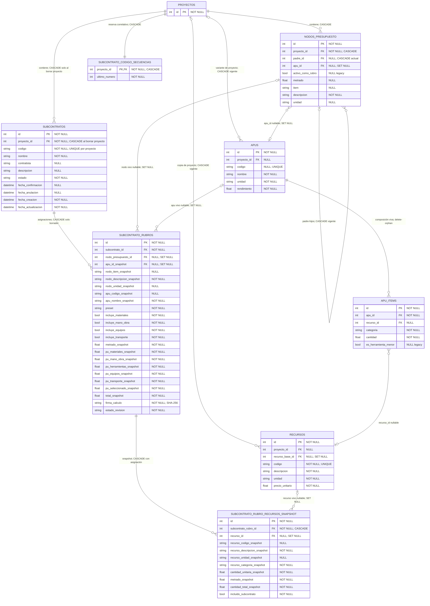
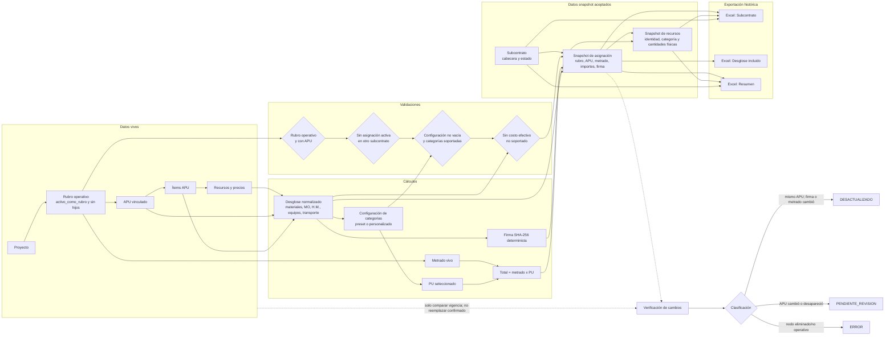

# Fase 0.5 — Diseño de arquitectura del módulo Subcontratos

**Fecha:** 2026-07-13  
**Estado:** diseño previo a implementación  
**Alcance:** arquitectura, propiedad de datos, persistencia, cálculo y rendimiento.  
**Restricción aplicada:** no se modificó código, migraciones ni `presupuestos.db`.

## 1. Entendimiento del objetivo

Este documento convierte el PRD aprobado y la validación de Fase 0 en un diseño técnico listo para preparar la migración de Fase 1. No amplía el alcance funcional: Subcontratos continúa siendo una vista interna de Presupuestos, vinculada al proyecto abierto, con categorías completas, exclusividad de rubros, snapshots históricos y tres hojas Excel.

No se reutiliza `SIN_APU`; no se incorpora `otros`; no se modelan indirectos, IVA, proveedores estructurados, términos de pago, firmas, planillas ni pagos.

## 2. Información faltante y supuestos

No hay decisiones funcionales bloqueantes. Las decisiones de este documento son técnicas y se derivan de las reglas aprobadas.

Convenciones técnicas:

- “Asignación activa” significa una fila de `subcontrato_rubros` cuyo `subcontrato.estado` es `BORRADOR` o `CONFIRMADO`.
- Los nombres de timestamps siguen la convención actual en español: `fecha_creacion` y `fecha_actualizacion`.
- Los cálculos continúan normalizándose a cuatro decimales para conservar compatibilidad con el motor actual.
- La referencia a un nodo o recurso vivo puede quedar `NULL`; el snapshot textual y monetario conserva la historia.

## 3. Plan y criterios de calidad de este diseño

El diseño se considera listo para Fase 1 si:

1. preserva historia aunque se eliminen nodos, APUs o recursos vivos;
2. permite historia anulada y, a la vez, una sola asignación activa por rubro;
3. distingue cambios de APU, cambios del mismo APU/metrado y cambios solo informativos;
4. genera códigos no reutilizables de manera segura en SQLite;
5. evita JSON para importes críticos y permite consultas/exportación simples;
6. no obliga a cargar snapshots de recursos en listas o detalles resumidos;
7. puede migrar a PostgreSQL sin rediseñar el dominio;
8. no agrega entidades ni campos funcionales fuera del PRD.

## 4. Diagrama ERD simplificado



### Regla de exclusividad e historia

No se crea `UNIQUE(nodo_presupuesto_id)` porque impediría conservar asignaciones anuladas. Tampoco puede expresarse correctamente con un índice parcial de SQLite: el estado activo está en la tabla padre.

La garantía será doble:

1. servicio transaccional centralizado que, antes de asignar, busca otra asignación del mismo nodo unida a un subcontrato `BORRADOR` o `CONFIRMADO`;
2. transacción de escritura que serializa la validación/asignación en SQLite y prueba colisiones. En PostgreSQL el mismo servicio podrá usar bloqueo de fila o una restricción más avanzada.

Una asignación de un subcontrato `ANULADO` queda en la base como historia, pero no bloquea. Un borrador eliminado borra en cascada sus asignaciones y snapshots. Un confirmado nunca se elimina físicamente.

`proyecto_id → subcontratos` conserva el `CASCADE` coherente con el dominio actual: borrar un proyecto elimina todo su presupuesto. La aplicación debe seguir tratando la eliminación de proyecto como operación sensible; no se introduce un comportamiento distinto solo para Subcontratos.

## 5. Diagrama de flujo de datos



Los exportadores no vuelven a consultar costos vivos para sustituir snapshots. En borrador usan el último snapshot aceptado del borrador; en confirmado/anulado usan historia. Los datos vivos solo sirven para advertir cambios.

## 6. Matriz de propiedad de datos

| Dato | Propietario | Tipo | Creación | Actualización | Conservación | Eliminación |
|---|---|---|---|---|---|---|
| Código del subcontrato | `subcontratos.codigo`; correlativo en `subcontrato_codigo_secuencias` | Cabecera viva con identidad histórica | Al crear borrador | Nunca cambia | Confirmado/anulado; correlativo permanece aunque se elimine borrador | Código de cabecera desaparece con borrador eliminado, pero el número no vuelve a emitirse |
| Estado del subcontrato | `subcontratos.estado` | Vivo e histórico | `BORRADOR` | Confirmar, reabrir o anular | Siempre en confirmados/anulados | Solo desaparece si se elimina un borrador |
| Metrado vigente | `nodos_presupuesto.metrado` | Vivo | Importación/edición de presupuesto | Fuera del módulo | Mientras exista nodo | Según ciclo del nodo/proyecto |
| Metrado aceptado | `subcontrato_rubros.metrado_snapshot` | Snapshot | Asignar/reconfigurar/actualizar/revisar | Solo al aceptar una regeneración en borrador | Confirmado/anulado | Con borrador/asignación eliminada |
| APU vinculado vigente | `nodos_presupuesto.apu_id` | Vivo | Vinculación | Vincular/desvincular/sustituir | Mientras exista nodo | `SET NULL` si APU desaparece |
| APU aceptado | `apu_id_snapshot`, `apu_codigo_snapshot`, `apu_nombre_snapshot` | Snapshot + referencia viva opcional | Al generar snapshot | Al aceptar revisión de nuevo APU | Confirmado/anulado aunque FK quede `NULL` | Con borrador/asignación eliminada |
| Selección de categorías | booleanos y `preset` en `subcontrato_rubros` | Snapshot de configuración | Asignar | Reconfigurar en borrador o aceptar revisión | Confirmado/anulado | Con asignación eliminada |
| PU por categoría | columnas `pu_*_snapshot` | Snapshot monetario | Al calcular snapshot | Regeneración aceptada en borrador | Confirmado/anulado | Con asignación eliminada |
| PU seleccionado | `pu_seleccionado_snapshot` | Snapshot monetario derivado | Al calcular snapshot | Regeneración aceptada | Confirmado/anulado | Con asignación eliminada |
| Total seleccionado | `total_snapshot` | Snapshot monetario derivado | `metrado_snapshot × pu_seleccionado_snapshot` | Regeneración aceptada | Confirmado/anulado | Con asignación eliminada |
| Firma de cálculo | `subcontrato_rubros.firma_calculo` | Snapshot técnico | Al calcular snapshot | Regeneración aceptada | Confirmado/anulado | Con asignación eliminada |
| Recursos vivos | `recursos` y `apu_items` | Vivo | Gestión APU/recursos | Fuera de Subcontratos | Según ciclo APU/recurso | Según reglas existentes |
| Recursos y cantidades físicas aceptadas | `subcontrato_rubro_recursos_snapshot` | Snapshot | Junto con asignación | Se reemplazan en una regeneración aceptada, dentro de la misma transacción | Confirmado/anulado | Con asignación eliminada |
| Ítem/código del rubro vigente | `nodos_presupuesto.item` | Vivo | Presupuesto | Edición/importación | Mientras exista nodo | Con nodo/proyecto |
| Descripción y unidad del rubro vigentes | `nodos_presupuesto.descripcion/unidad` | Vivo | Presupuesto | Edición/importación | Mientras exista nodo | Con nodo/proyecto |
| Ítem, descripción y unidad aceptados del rubro | `nodo_*_snapshot` | Snapshot textual | Al generar snapshot | Al aceptar actualización/revisión | Confirmado/anulado | Con asignación eliminada |
| Código, descripción y unidad vigentes del recurso | `recursos` | Vivo | Gestión de recursos | Gestión de recursos | Mientras exista recurso | Según reglas existentes |
| Código, descripción y unidad aceptados del recurso | `recurso_*_snapshot` | Snapshot textual | Al generar snapshot | Al regenerar snapshot aceptado | Confirmado/anulado aunque FK quede `NULL` | Con snapshot/asignación eliminada |
| Estado de revisión | `subcontrato_rubros.estado_revision` | Estado derivado persistido | `ACTUALIZADO` al aceptar snapshot | Verificación o aceptación de cambios | Confirmado conserva advertencia sin sobrescribir valores | Con asignación eliminada |

La configuración e importes aceptados viven en la misma fila porque forman una unidad transaccional. Los recursos se separan porque son una colección y se consultan bajo demanda.

## 7. Definición exacta de la firma de cálculo

### 7.1 Objetivo y clasificación

Se almacena un único SHA-256 llamado `firma_calculo`. La clasificación nunca depende solo de que la firma difiera; se aplica en este orden:

1. nodo inexistente, no operativo o proyecto inconsistente → `ERROR`;
2. `nodo.apu_id` nulo, APU inexistente o `nodo.apu_id != apu_id_snapshot` → `PENDIENTE_REVISION`;
3. mismo `apu_id`, pero `firma_actual != firma_calculo` o `r4(metrado_actual) != metrado_snapshot` → `DESACTUALIZADO`;
4. todo coincide → `ACTUALIZADO`.

Esto evita interpretar un cambio de APU como una actualización automática del mismo cálculo.

### 7.2 Payload canónico

El hash es:

```text
SHA256(UTF8(JSON_CANONICO(payload)))
```

`JSON_CANONICO` cumple:

- UTF-8;
- claves ordenadas lexicográficamente;
- separadores exactos `,` y `:` sin espacios;
- sin ASCII escaping innecesario;
- booleanos JSON `true/false`;
- nulos JSON `null`;
- decimales de cálculo serializados como strings con exactamente cuatro decimales y punto (`"12.3400"`);
- versión explícita para que un cambio futuro de regla sea detectable.

Payload:

```json
{
  "apu_id": 123,
  "items": [
    {
      "cantidad": "1.2500",
      "categoria": "material",
      "recurso_base_id": null,
      "recurso_id": 456,
      "precio_unitario": "7.8000"
    }
  ],
  "regla_herramienta_menor": {
    "base": "mano_de_obra",
    "porcentaje": "0.0500",
    "version": 1
  },
  "rendimiento": "1.0000",
  "version_firma": 1
}
```

### 7.3 Normalización y orden

1. `apu_id`: entero del APU vivo; obligatorio. También se compara por separado antes del hash.
2. `rendimiento`: aplicar la misma función oficial `_r4`; serializar con cuatro decimales.
3. Ítems: excluir cualquier fila con `es_herramienta_menor == true`, porque el motor actual la ignora y H.M. se deriva de MO. Incluir la constante versionada de regla H.M.
4. Ítems sin recurso: el motor actual los ignora; no entran en la firma monetaria. Deben generar advertencia técnica si no son la fila derivada de H.M.
5. `categoria`: normalizar a los cuatro valores aprobados (`material`, `mano_de_obra`, `equipo`, `transporte`). Una categoría distinta se detecta antes de firmar y bloquea confirmación si tiene costo efectivo; no se incorpora como categoría soportada.
6. `recurso_id`: entero o `null`; se incluye como identidad vigente.
7. `recurso_base_id`: entero o `null`; se incluye para distinguir linaje de copias de proyecto y soportar consolidación.
8. `cantidad`: `_r4(item.cantidad)`, cuatro decimales.
9. `precio_unitario`: `_r4(recurso.precio_unitario)`, cuatro decimales.
10. Orden canónico de ítems: ordenar por la tupla `(categoria, recurso_base_id_or_-1, recurso_id_or_-1, cantidad, precio_unitario)`. El campo `apu_items.orden` no entra: cambiar solo la presentación no cambia costo ni cantidades.
11. Si existen dos ítems idénticos, ambos permanecen en el arreglo; no se deduplican. La multiplicidad afecta composición.

### 7.4 Tratamiento de cada dato solicitado

| Dato | En firma | Tratamiento |
|---|---|---|
| `apu_id` | Sí | También comparación previa; cambio → `PENDIENTE_REVISION` |
| Rendimiento | Sí | `_r4`; cambio con mismo APU → `DESACTUALIZADO` |
| Orden de ítems | No | Informativo/presentación; se usa orden canónico independiente |
| Categoría | Sí | Normalizada; cambio → `DESACTUALIZADO`; no soportada se valida antes |
| `recurso_id` | Sí | Identidad exacta del recurso vigente |
| `recurso_base_id` | Sí | Linaje/consolidación; no sustituye a `recurso_id` |
| Cantidad/coeficiente | Sí | `_r4`; cambio → `DESACTUALIZADO` |
| Precio unitario | Sí | `_r4`; cambio → `DESACTUALIZADO` |
| `es_herramienta_menor` | Indirecto | Filas `true` excluidas; regla derivada 5% versionada sí entra |
| Metrado | No | Se compara por separado a 4 decimales; cambio → `DESACTUALIZADO` |
| Descripción/código del APU | No | Snapshot informativo; cambio textual no altera cálculo |
| Descripción/ítem/unidad del rubro | No | Snapshot contractual; cambio textual no altera firma. Si deja de ser operativo → `ERROR` |
| Descripción/código del recurso | No | Snapshot informativo; cambio textual no altera cálculo |
| Unidad del recurso | No en firma monetaria | Se compara al generar materiales porque afecta agrupación/exportación; cambio se trata como `DESACTUALIZADO` mediante una validación de snapshot físico |
| Unidad del APU | No | Informativa; la compatibilidad rubro/APU sigue el flujo de revisión ya existente, no el hash monetario |

### 7.5 Firma monetaria y snapshot físico

La unidad del recurso no cambia un valor numérico, pero sí la interpretación y agrupación de cantidades. Para no contaminar la definición de `firma_calculo`, la verificación compara además la lista física canónica actual contra los snapshots de recursos usando `(recurso_id, recurso_base_id, categoria, unidad, cantidad_unitaria)`. Una diferencia con el mismo APU marca `DESACTUALIZADO`.

Textos descriptivos no disparan recálculo. Permanecen congelados hasta que la persona acepte una actualización/revisión; en un confirmado, la exportación conserva el texto aceptado.

## 8. Evaluación de la estrategia de código secuencial

| Alternativa | No reutilización | Concurrencia | Borrador eliminado | Legibilidad | Complejidad | PostgreSQL |
|---|---|---|---|---|---|---|
| Tabla `subcontrato_codigo_secuencias` | Sí | Buena si incremento y alta ocurren en una transacción serializada | Conserva `ultimo_numero` | Excelente: `SC-001` | Media; una tabla y servicio | Migrable a secuencia/identity manteniendo códigos existentes |
| Código derivado de `id` | Sí mientras no se resetee SQLite sequence | Alta; la PK resuelve concurrencia | No reutiliza normalmente | Buena, pero puede haber saltos globales y no es secuencia por proyecto | Baja | Fácil, pero semántica por proyecto requiere lógica extra |
| Máximo código histórico + 1 | Solo si nunca se borra la fila histórica | Débil: dos transacciones pueden obtener el mismo máximo | Reutiliza si el mayor borrador se elimina | Excelente | Baja aparente, alta por colisiones | Requiere bloqueo/reintentos igualmente |
| Registro de códigos emitidos/tombstones | Sí | Buena con `UNIQUE` | Conserva todos los códigos emitidos | Excelente | Alta: tabla histórica adicional por emisión | Migrable, pero duplica información |

### Recomendación definitiva

Usar `subcontrato_codigo_secuencias` con una fila por proyecto.

En SQLite, la creación debe ejecutarse dentro de una transacción de escritura que reserve el siguiente número y cree la cabecera; `UNIQUE(proyecto_id, codigo)` es la última defensa. Ante una colisión excepcional, toda la transacción revierte y puede reintentarse de forma acotada. No se usa `MAX()+1`.

Ventajas:

- conserva no reutilización aunque se elimine un borrador;
- mantiene formato secuencial por proyecto;
- no obliga a conservar tombstones funcionales;
- separa el correlativo de la PK técnica;
- permite migrar a PostgreSQL manteniendo la tabla o reemplazando su implementación detrás del mismo servicio.

El código se formatea `SC-{numero:03d}`; después de 999 continúa naturalmente como `SC-1000`, sin truncar ni reiniciar.

## 9. Evaluación de snapshots monetarios

| Diseño | Consultas/exportación | Pruebas | Flexibilidad | Rendimiento | Integridad | Migraciones/compatibilidad |
|---|---|---|---|---|---|---|
| Columnas explícitas | Simples, indexables y sin parsear JSON | Muy directas | Limitada a categorías conocidas | Mejor para lista/agregados | `NOT NULL`, checks y tipos por columna | Excelente en SQLite/SQLAlchemy; nueva categoría exige migración |
| JSON estructurado | Requiere extracción JSON y validación en aplicación | Más combinaciones/errores de forma | Alta | Adecuado en lectura puntual, peor en agregados | Débil sin validación adicional | SQLite JSON y PostgreSQL JSONB difieren; cambios sin migración formal |
| Híbrido: explícitas + JSON monetario auxiliar | Duplicación y riesgo de divergencia | Debe reconciliar dos fuentes | Alta | Más almacenamiento y complejidad | Dos fuentes de verdad | Migraciones y mantenimiento más costosos |

### Recomendación definitiva

Usar **columnas explícitas** para los cinco componentes monetarios aprobados, más PU seleccionado y total. No guardar un JSON monetario.

El modelo global ya es híbrido de manera relacional: valores monetarios escalares en `subcontrato_rubros` y colección física variable en `subcontrato_rubro_recursos_snapshot`. Esa separación ofrece flexibilidad sin crear una segunda fuente de verdad.

Campos monetarios definitivos:

- `pu_materiales_snapshot`
- `pu_mano_obra_snapshot`
- `pu_herramientas_snapshot`
- `pu_equipos_snapshot` (equipo base, sin H.M.)
- `pu_transporte_snapshot`
- `pu_seleccionado_snapshot`
- `total_snapshot`

Todos `NOT NULL`, normalizados a cuatro decimales. H.M. permanece separada de equipo en el nuevo modelo aunque el contrato actual del endpoint APU continúe mostrando equipo con H.M. incluida.

No se añade `pu_completo_snapshot`: se reconstruye como suma de los cinco componentes explícitos. Evitar esta columna elimina una redundancia y un posible desacuerdo. Tampoco se guarda la configuración en JSON porque son cuatro booleanos estables y consultables.

## 10. Rendimiento y consultas críticas

### 10.1 Lista de subcontratos

Consulta `subcontratos` por `proyecto_id`, con agregación de `COUNT(subcontrato_rubros.id)`, `SUM(total_snapshot)` y conteos condicionales de alertas. No une snapshots de recursos.

Índice: `subcontratos(proyecto_id, estado)` y `subcontrato_rubros(subcontrato_id, estado_revision)`.

### 10.2 Detalle

Carga una cabecera y asignaciones resumidas. Puede unir el nodo vivo y APU vivo solo para mostrar vigencia; los textos e importes aceptados salen de `subcontrato_rubros`. No carga `subcontrato_rubro_recursos_snapshot` salvo solicitud de desglose/materiales.

### 10.3 Distribución general

Una consulta trae nodos del proyecto y calcula rubro operativo con hijos precargados/agrupados. Otra consulta trae todas las asignaciones activas del proyecto con código/nombre del subcontrato. APUs y costos se cargan por IDs únicos solo para rubros visibles que requieren previsualización; no por fila.

Índices: `nodos_presupuesto(proyecto_id)`, índice existente de operativo y `subcontrato_rubros(nodo_presupuesto_id)`.

### 10.4 Asignación masiva

1. cargar cabecera editable;
2. cargar todos los nodos solicitados y sus hijos en lote;
3. consultar asignaciones activas para todos los `nodo_id` con un único `IN`;
4. cargar APUs únicos con ítems/recursos mediante `selectinload` o `joinedload` medido;
5. calcular cada APU una vez y cachear por `apu_id` durante la operación;
6. construir asignaciones y snapshots en memoria;
7. usar `add_all`/flush y un solo `commit` para el lote consistente, o savepoints por elemento si la implementación de éxito parcial los necesita.

Nunca hacer un `commit` por rubro ni por recurso.

### 10.5 Verificación de cambios

Cargar asignaciones resumidas del subcontrato, nodos vivos por IDs y APUs únicos con composición. Calcular una firma por APU único, luego comparar metrado y lista física por asignación. Para confirmados, devolver estados calculados/advertencias sin reemplazar snapshots.

### 10.6 Actualización

Prevalidar selección en lote, cachear desglose por APU y reemplazar cabecera de snapshot + recursos dentro de la misma transacción. Borrar/insertar los recursos snapshot solo de asignaciones aceptadas, no de todo el subcontrato.

### 10.7 Materiales a suministrar

Consultar exclusivamente snapshots de categoría `material` con `incluido_subcontrato = false` para las asignaciones del subcontrato. Agrupar en SQL cuando haya `recurso_id`; aplicar fallback normalizado de código/descripción/unidad en servicio para recursos sin ID. No cargar recursos vivos.

Índice: `(subcontrato_rubro_id, recurso_categoria_snapshot, incluido_subcontrato)`.

### 10.8 Exportación

Cargar cabecera, asignaciones y snapshots de recursos en dos o tres consultas acotadas. La exportación confirmada/anulada no consulta APUs/recursos vivos para calcular importes. La advertencia de desactualización puede provenir de una verificación previa o una comparación agrupada, pero nunca sustituye valores históricos.

### Controles transversales

- Evitar N+1 con cargas por relaciones e IDs únicos.
- No serializar relaciones ORM lazy después de cerrar la sesión.
- Seleccionar solo columnas requeridas en lista/distribución.
- Paginar o virtualizar en frontend si la distribución supera el volumen cómodo; no cambia el contrato de dominio.
- No recalcular el proyecto al cambiar filtros locales.
- Medir número de consultas y `EXPLAIN QUERY PLAN` en Fase 8.
- No consultar tablas completas sin filtro de proyecto/subcontrato.

## 11. Preparación para evolución futura

Estas rutas no se implementan ahora ni agregan campos a la primera migración:

- **Múltiples presupuestos/versiones:** introducir una entidad `presupuestos` o `presupuesto_versiones` entre proyecto y nodos; añadir luego `presupuesto_version_id` a subcontratos. Los snapshots actuales siguen siendo válidos porque ya congelan nodo/APU/recursos.
- **Catálogo de contratistas:** reemplazar progresivamente el texto libre con `contratista_id NULL`, conservando `contratista` como snapshot textual histórico durante la migración.
- **Términos contractuales:** entidad/versionado separado asociado al subcontrato; no columnas dispersas en la cabecera actual.
- **Planillas y avances:** entidades hijas de un subcontrato confirmado y sus rubros; no modificar snapshots aceptados.
- **Pagos:** módulo contable vinculado a planillas aprobadas, sin convertir `total_snapshot` en saldo mutable.
- **Recursos incluidos:** la tabla snapshot ya guarda `incluido_subcontrato`; una vista futura puede consultarlos sin una cuarta hoja ni nueva entidad ahora.

La preparación consiste en conservar IDs, snapshots y relaciones claras, no en anticipar tablas o columnas sin requisitos.

## 12. Simplificaciones evaluadas

### Elementos que se conservan

- `subcontratos`: cabecera, estado y ciclo de vida.
- `subcontrato_rubros`: necesaria para exclusividad, configuración, revisión e importes.
- `subcontrato_rubro_recursos_snapshot`: necesaria para cantidades físicas, materiales excluidos e historia aunque cambien recursos.
- `subcontrato_codigo_secuencias`: necesaria para no reutilización tras eliminar borradores sin conservar tombstones.
- cinco columnas monetarias: necesarias para selección por categorías, desglose y H.M. separada.
- snapshots textuales de rubro/APU/recurso: necesarios para exportar historia después de eliminaciones/cambios.

### Elementos eliminados o no añadidos

- No `pu_completo_snapshot`: suma determinista de cinco columnas.
- No booleano `incluye_herramientas`: deriva de `incluye_mano_obra`.
- No JSON de importes/configuración.
- No tabla de presets: son un conjunto cerrado de reglas de aplicación; `preset` registra el nombre y los booleanos son la verdad aceptada.
- No tabla de versiones de snapshot: la fila representa el último estado aceptado del borrador; confirmado/anulado queda inmutable. El PRD no exige historial de cada edición intermedia.
- No tabla materializada de materiales consolidados: se deriva bajo demanda de recursos snapshot.
- No duplicar `proyecto_id` en `subcontrato_rubros`: se obtiene del padre; la validación de proyecto ocurre en servicio.
- No guardar estado “asignación activa”: deriva del estado de cabecera.
- No campos de `otros`, indirectos, IVA, términos, firma ni proveedor estructurado.

### Ajuste recomendado a `apu_id_snapshot`

El nombre del PRD mezcla snapshot con FK viva. Se mantiene por compatibilidad conceptual, pero técnicamente será una FK nullable a `apus.id` con `ON DELETE SET NULL`; la identidad histórica se conserva en `apu_codigo_snapshot` y `apu_nombre_snapshot`. Si el APU se elimina, la asignación sigue exportable y la verificación clasifica el cambio.

## 13. Modelo final listo para convertirse en migración

### Tabla `subcontratos`

- columnas del PRD;
- `UNIQUE(proyecto_id, codigo)`;
- check lógico/DB para estado entre `BORRADOR`, `CONFIRMADO`, `ANULADO`;
- índices `(proyecto_id, estado)` y `(proyecto_id, fecha_actualizacion)`.

### Tabla `subcontrato_codigo_secuencias`

- `proyecto_id PK/FK`;
- `ultimo_numero NOT NULL` con check `>= 0`.

### Tabla `subcontrato_rubros`

- campos del PRD;
- añadir `nodo_item_snapshot`, `nodo_descripcion_snapshot`, `nodo_unidad_snapshot`;
- FKs vivas nullable con `SET NULL` para nodo y APU;
- importes explícitos `NOT NULL` a cuatro decimales;
- checks: al menos una categoría; H.M. no editable; estados/presets permitidos; importes/cantidades coherentes según tolerancia de 4 decimales;
- índices `(subcontrato_id, estado_revision)`, `nodo_presupuesto_id`, `apu_id_snapshot`.

### Tabla `subcontrato_rubro_recursos_snapshot`

- campos del PRD;
- FK de asignación con `CASCADE` y recurso vivo con `SET NULL`;
- índices `(subcontrato_rubro_id, recurso_categoria_snapshot, incluido_subcontrato)` y `(recurso_id, recurso_unidad_snapshot)`.

### Invariante fuera de una restricción simple

La exclusividad por estado del padre queda en un único servicio transaccional, respaldada por consultas y pruebas de concurrencia. No se intenta resolver con una unicidad incorrecta que elimine historia.

## 14. Decisiones técnicas definitivas

1. Cuatro tablas nuevas: tres de dominio/snapshot y una secuencia técnica.
2. Código `SC-NNN` generado por secuencia persistente por proyecto.
3. Importes por columnas explícitas; sin JSON monetario.
4. H.M. separada de equipos en snapshots y derivada siempre de MO.
5. Firma SHA-256 canónica, independiente del orden de presentación.
6. `apu_id` y metrado se comparan por separado para clasificar cambios.
7. La lista física se compara además de la firma monetaria para detectar cambios de unidad/cantidad.
8. Nodos, APUs y recursos vivos usan referencias nullable `SET NULL`; los textos snapshot conservan historia.
9. Exclusividad en servicio transaccional; las asignaciones anuladas se conservan.
10. Recursos snapshot bajo demanda; no forman parte de consultas de lista.

## 15. Riesgos residuales

- SQLite serializa escrituras; operaciones masivas muy grandes deben mantenerse breves y medidas.
- La exclusividad entre tablas no tiene una única restricción declarativa en SQLite; depende de que todas las escrituras pasen por el servicio central.
- El sistema actual usa `Float`; la normalización `_r4` debe ser idéntica para evitar falsos positivos de firma.
- El contrato actual de APU mezcla H.M. en equipo. La extracción del desglose normalizado requiere pruebas exhaustivas sin cambiar ese contrato.
- El borrado en cascada de un proyecto elimina su historia de subcontratos, coherente con el dominio actual pero sensible operacionalmente.
- Cambios solo textuales no marcan desactualización automática; los confirmados conservan deliberadamente el texto aceptado.

## 16. Archivos que corresponderían a la Fase 1

Crear:

- `backend/app/models/subcontrato.py`
- `backend/app/schemas/subcontrato.py`
- `backend/alembic/versions/0018_subcontratos.py`
- `tests/test_subcontratos_modelo.py`

Modificar:

- `backend/app/models/__init__.py`

No corresponde modificar `backend/app/db.py`, endpoints, frontend ni exportadores durante la Fase 1.

## 17. Revisión final

- El ERD incluye entidades existentes, nuevas, cardinalidades, nulabilidad y reglas de borrado.
- El flujo distingue datos vivos, cálculos, validaciones, snapshots y exportación histórica.
- La matriz define propietario y ciclo de vida de cada dato requerido.
- La firma tiene payload, orden, normalización y clasificación deterministas.
- Se compararon cuatro estrategias de código y tres de snapshots monetarios.
- Se diseñaron consultas críticas y controles contra N+1/recalculo/commits repetidos.
- La evolución futura no agrega campos al alcance actual.
- El modelo se simplificó sin perder exclusividad, trazabilidad, exportación histórica, detección ni rendimiento.
- **No se modificó código, no se creó ninguna migración y no se escribió en `presupuestos.db`. El único archivo creado es este documento.**
